# Netron 图布局与渲染设计与实现分析

本文档对 Netron 项目中**图布局规则**、**图渲染**与**性能优化**的设计与实现进行详细分析，便于与 df-scheduler-viz 等项目的图视图实现对照与借鉴。

---

## 总览：从模型到屏幕

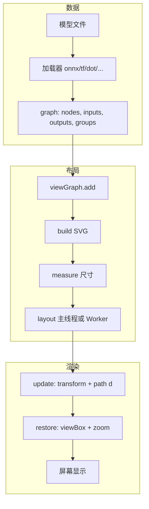

---

## 一、项目结构概览

### 1.1 技术栈与入口

- **类型**：神经网络/深度学习模型可视化器（Electron 桌面 + 浏览器）
- **版本**：8.9.1（package.json）
- **入口**：`source/app.js`（Electron）、`source/index.js`（浏览器预加载：view、grapher、browser 等）
- **图相关**：**无 G6 等第三方图库**，采用自研 **SVG + 自嵌 dagre 风格布局**

### 1.2 核心模块与职责

| 模块 | 路径 | 职责 |
| ------ | ------ | ------ |
| 视图层 | `source/view.js` | 渲染流程编排、Worker 创建/取消、导出（SVG/PNG）、缩放/平移、画布创建 |
| 图数据与 SVG | `source/grapher.js` | 图结构（Graph/Node/Edge）、SVG 构建/测量/布局调用/更新、边路径与曲线 |
| 布局算法 | `source/dagre.js` | 自包含 DAG 布局（类 dagre/graphlib）：分层、排序、坐标分配、边路径点、dummy 节点 |
| 布局 Worker | `source/worker.js` | 在 Web Worker 中执行 `dagre.layout`，避免大图阻塞主线程 |
| 样式 | `source/grapher.css` | 节点/边/簇/选中态等样式 |

数据流：各格式加载器（onnx.js、tf.js、dot.js 等）产出统一图结构（`graph.nodes` / `graph.inputs` / `graph.outputs` / `graph.groups`）→ view 层驱动 grapher 完成 build → measure → layout → update → restore。

---

## 二、图布局规则设计与实现

### 2.1 布局流水线总览

整体流程（`view.js` → `grapher.js` → `dagre.js`）：

```text
render()
  → viewGraph.add(graph, signature)     // 从业务图构建 grapher 图
  → viewGraph.build(document)           // 创建 SVG 结构（#canvas → #origin → clusters/edges/nodes）
  → viewGraph.measure()                 // 测量节点尺寸（含字体就绪、requestAnimationFrame）
  → viewGraph.layout(worker)            // 调用 dagre 布局（主线程或 Worker）
  → viewGraph.update()                  // 把布局结果写回 SVG（transform、path d）
  → viewGraph.restore(state)            // 应用缩放、视口、可选选中态
```

布局的“输入/输出”在 `grapher.js` 的 `layout(worker)` 中：

- **输入**：`nodes`（v, width, height, parent）、`edges`（v, w, minlen, weight, width, height, labeloffset, labelpos）、`layout`（nodesep, ranksep, rankdir, 可选 ranker）。
- **输出**：写回 `this.node(·).label` 的 `x/y`（及簇的 width/height），`this.edge(·).label` 的 `points`（及可选 `x,y` 边标签位置）；再对每个真实节点调用 `node.layout()` 做块内垂直排布。

#### 2.1.1 布局流水线流程图

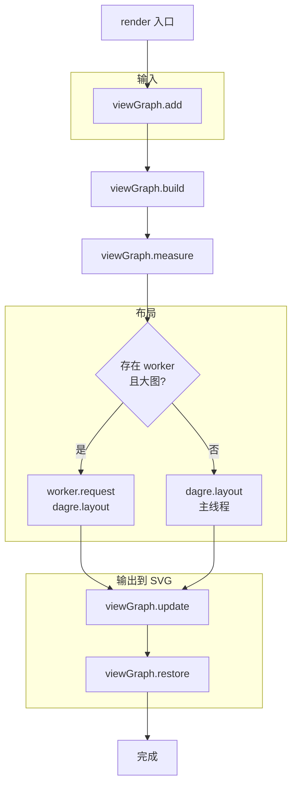

### 2.2 布局参数与策略（grapher.js）

- **nodesep / ranksep**：默认均为 20（`layout.nodesep = 20`, `layout.ranksep = 20`）。
- **方向**：由 `this.options.direction` 决定；若为垂直则 rankdir 默认 TB，否则 LR；无边时若为垂直会反转 nodes 顺序以配合 rankdir。
- **大图策略**：`nodes.length > 3000` 时：
  - `layout.ranker = 'longest-path'`（只做最长路径分层，不做 network simplex 优化，速度快）；
  - 通过 `worker.request(..., 2500, '...')` 在 Web Worker 中执行布局，超时 2500ms 可取消，避免 UI 卡死。

#### 2.2.1 大图策略分支图

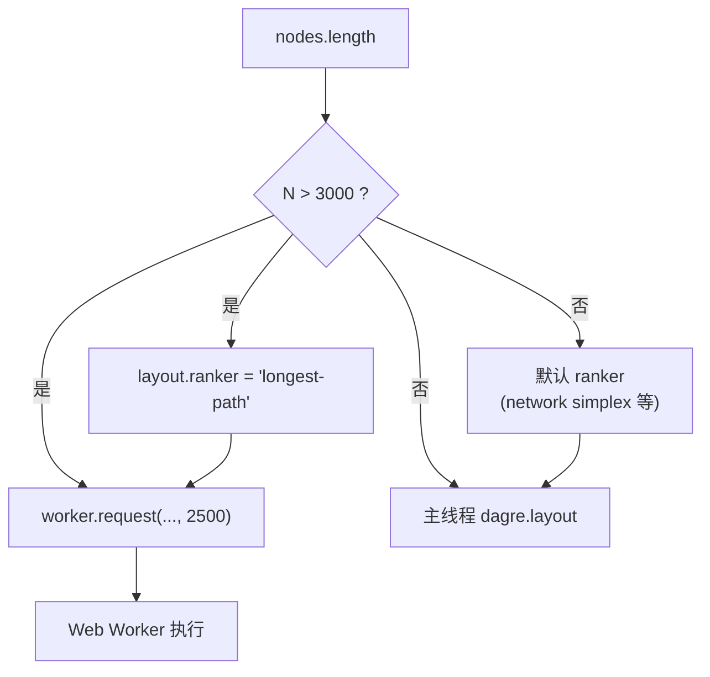

```javascript
// grapher.js 219-270
layout.nodesep = 20;
layout.ranksep = 20;
const direction = this.options.direction;
const rotate = edges.length === 0 ? direction === 'vertical' : direction !== 'vertical';
if (rotate) layout.rankdir = 'LR';
// ...
if (nodes.length > 3000) layout.ranker = 'longest-path';
if (worker) {
    const message = await worker.request({ type: 'dagre.layout', nodes, edges, layout, state }, 2500, '...');
    // ...
}
```

### 2.3 dagre.js 布局算法结构

`dagre.layout(nodes, edges, layout, state)` 内部用一张**有向复合图** `g`（`dagre.Graph(true, true)`）做所有计算，最后把节点的 `x/y` 和边的 `points`（及边标签 `x,y`）写回传入的 `nodes`/`edges` 数组。

#### 2.3.1 主要步骤（tasks 顺序）

1. **makeSpaceForEdgeLabels**：为边标签留空间（ranksep 减半、minlen 加倍、label 宽高增加 offset）。
2. **removeSelfEdges**：自环先移除，用 selfEdges 记录，后续在 **insertSelfEdges** 中用 dummy 自环路径还原。
3. **acyclic_run**：反转部分边使图无环（DFS 找回边，反转并标记；最后 **acyclic_undo** 时再反转 `edge.points`）。
4. **nestingGraph_run**：处理复合图（子图/簇）的层级，插入 border 节点（borderTop/borderBottom 等）。
5. **rank**：为节点分配 `rank`（层）。
   - **longest-path**：从无入边节点 DFS，按后继最小 rank 递推；速度快，适合大图。
   - **tight-tree**：longest-path + feasible tree 调整。
   - **默认**：network simplex：longest-path 初排 → 建可行紧树 → 迭代找负割边、交换边、更新 rank。
6. **injectEdgeLabelProxies**：为带尺寸的边标签插入 dummy 节点（edge-proxy），用于后续在中间层放标签。
7. **removeEmptyRanks**：去掉空层并重新编号 rank。
8. **normalize**：把跨多层的边拆成长度为 1 的链，插入 dummy 节点（`_d`），并记录 `state.dummyChains`；边标签 dummy 在对应 rank 上设 width/height。
9. **parentDummyChains**：在复合图中把 dummy 链挂到父节点（LCA）下。
10. **addBorderSegments**：为簇的左右边界加 borderLeft/borderRight dummy 节点。
11. **order**：在每层内给节点赋 `order`，以**减少边交叉**为主（barycenter 启发式、交叉数计算、多层扫描交换等）。
12. **insertSelfEdges**：把自环用 dummy 路径重新插入并生成 `points`。
13. **coordinateSystem_adjust**：若 rankdir 为 LR/RL，先交换所有 width/height，便于后续按“水平层”算坐标。
14. **position**：核心坐标分配：
    - **Y**：按层（layering）累加每层最大高度 + ranksep，节点 y 为层内居中。
    - **X**：采用 Brandes-Köpf 风格的水平坐标分配：
      - 对四种对齐方式（up/down × left/right）做 vertical alignment + horizontal compaction；
      - 选宽度最小的对齐，再对其它对齐做平移对齐；
      - 若未指定 `layout.align`，取四种 x 的中位数（(xs[1]+xs[2])/2）作为节点 x。
15. **positionSelfEdges**：为自环 dummy 计算弧线控制点并写回原边的 `points`。
16. **removeBorderNodes**：删除 border dummy，把簇的 width/height/x/y 写回父节点。
17. **denormalize**：沿 dummyChains 遍历，删除 dummy 节点并把其坐标依次 push 到 `edgeLabel.points`；边标签的 x,y,width,height 从 edge-label dummy 写回。
18. **fixupEdgeLabelCoords**：根据 labelpos（l/r）微调边标签位置。
19. **coordinateSystem_undo**：若 BT/RL 则 y 取反；若 LR/RL 则 x,y 互换并再交换 width/height，恢复为最终坐标系。
20. **translateGraph**：整体平移到最小坐标为 (0,0)，并记录 state.width/height。
21. **assignNodeIntersects**：为每条边在首尾增加与节点矩形的交点：用矩形中心与首/末点的射线求交，`edge.points` 首尾替换为这两个交点（若无 points 则仅首尾为两节点中心）。
22. **acyclic_undo**：恢复被反转的边及其 `points` 顺序。

最终从 `g` 写回：`node.x/y`、簇的 `node.width/height`、`edge.points`、边标签 `edge.x/y`。

#### 2.3.2 dagre 内部任务链图示

```mermaid
flowchart LR
    subgraph 预处理
        T1[makeSpaceForEdgeLabels]
        T2[removeSelfEdges]
        T3[acyclic_run]
        T4[nestingGraph_run]
    end

    subgraph 分层与归一化
        T5[rank]
        T6[injectEdgeLabelProxies]
        T7[removeEmptyRanks]
        T8[normalize]
        T9[parentDummyChains]
        T10[addBorderSegments]
    end

    subgraph 排序与坐标
        T11[order]
        T12[insertSelfEdges]
        T13[coordinateSystem_adjust]
        T14[position]
        T15[positionSelfEdges]
    end

    subgraph 收尾与写回
        T16[removeBorderNodes]
        T17[denormalize]
        T18[fixupEdgeLabelCoords]
        T19[coordinateSystem_undo]
        T20[translateGraph]
        T21[assignNodeIntersects]
        T22[acyclic_undo]
    end

    T1 --> T2 --> T3 --> T4 --> T5 --> T6 --> T7 --> T8 --> T9 --> T10
    T10 --> T11 --> T12 --> T13 --> T14 --> T15 --> T16 --> T17 --> T18 --> T19 --> T20 --> T21 --> T22
```

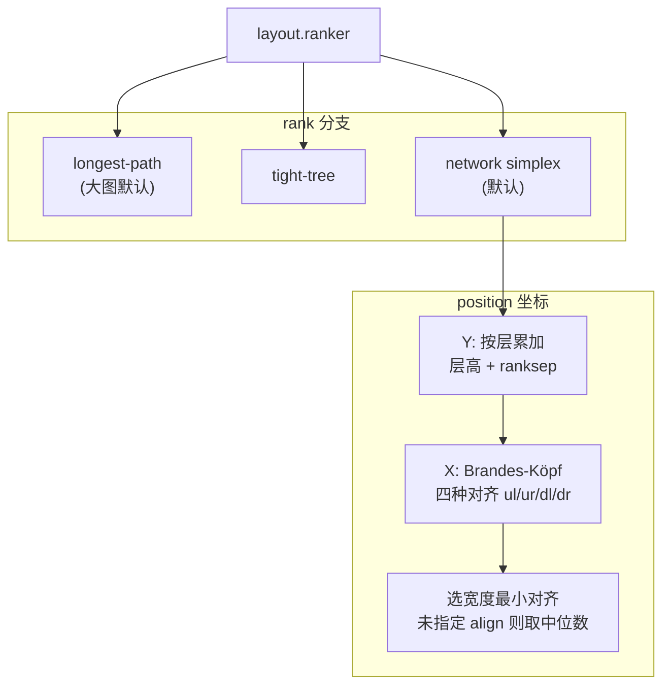

#### 2.3.3 层次与坐标直观示意

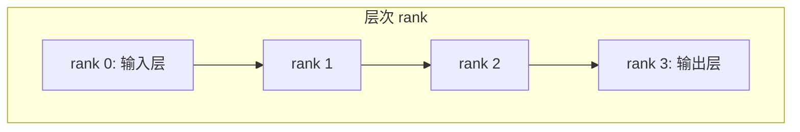

- **Y 坐标**：按层从上到下，每层 y = 当前累加高度 + 层内最大高度/2；层间距 = ranksep。
- **X 坐标**：同一层内按 `order` 从左到右；position 中通过四种对齐（ul/ur/dl/dr）做水平压缩，再取中位数或指定 align。

### 2.4 边路径点（points）的来源

- **跨层边**：经 normalize 插入的 dummy 链在 position 后具有 x,y；denormalize 时按链顺序把这些 (x,y) push 到 `edgeLabel.points`，形成折线。
- **自环**：positionSelfEdges 中直接给出 5 个控制点弧线。
- **首尾**：assignNodeIntersects 在每条边的 points 首尾插入与源/目标节点矩形的交点，使边从节点边界进出而非中心。

因此 grapher 层拿到的 `edge.points` 已是“从源节点边界 → 中间路点 → 目标节点边界”的折线。

#### 2.4.1 edge.points 来源示意图

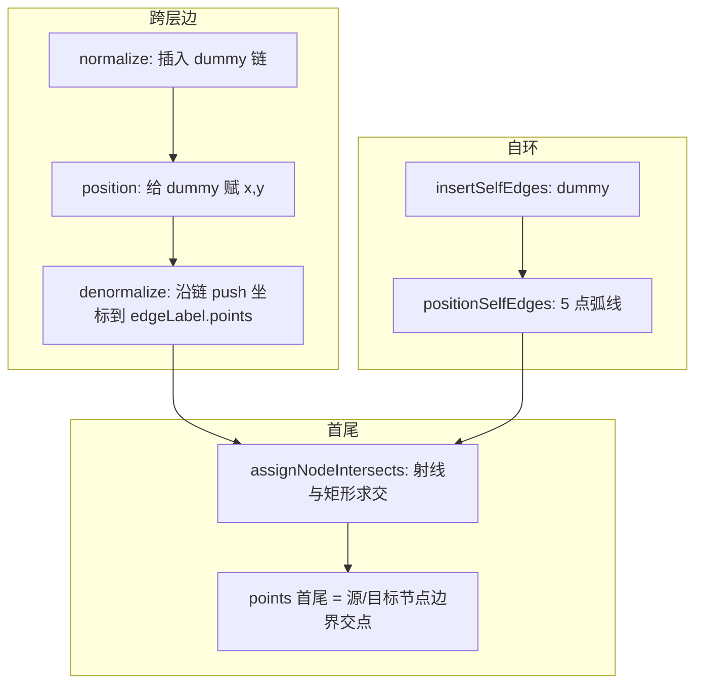

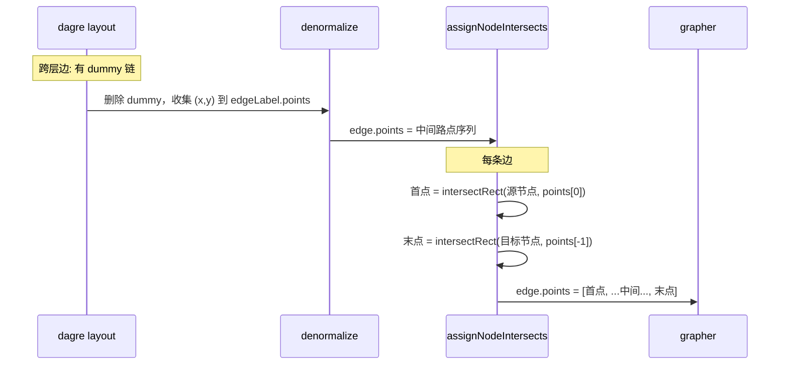

### 2.5 与 df-scheduler-viz 的对比要点

- Netron 使用**自嵌 dagre**（单文件 dagre.js），无 npm dagre 依赖；df-scheduler-viz 使用 @antv/g6 + dagre 或自研布局。
- 大图（>3000 节点）时 Netron **强制 longest-path + Worker**，用速度换质量；可借鉴“按规模切换 ranker 与是否 Worker”的策略。
- 布局参数（nodesep/ranksep）在 grapher 写死 20，如需可配置可在此扩展。
- 边线为**折线 + 曲线插值**（见下节），不是直线；节点边界交点算法与 grapher 的 `intersectRect` 一致思路。

---

## 三、图渲染与边绘制

### 3.1 画布与 SVG 结构

- **画布**：主“画布”是 **SVG**（`#canvas`），不是 HTML5 Canvas。在 `view.js` 的 `build(document)` 中创建：
  - `#canvas`（class `canvas`，preserveAspectRatio xMidYMid meet，width/height 100%）
  - `#background`（rect，fill none，pointer-events all，用于 Safari 拖拽/缩放兼容）
  - `#origin`（g），其下由 grapher 挂载：clusters → edge-paths（含 defs 里 arrowhead 等 marker）→ edge-paths-hit-test → edge-labels → nodes。

节点、边、簇均为 SVG 元素（g、path、rect、text、marker）。

#### 3.1.1 画布 SVG 结构图

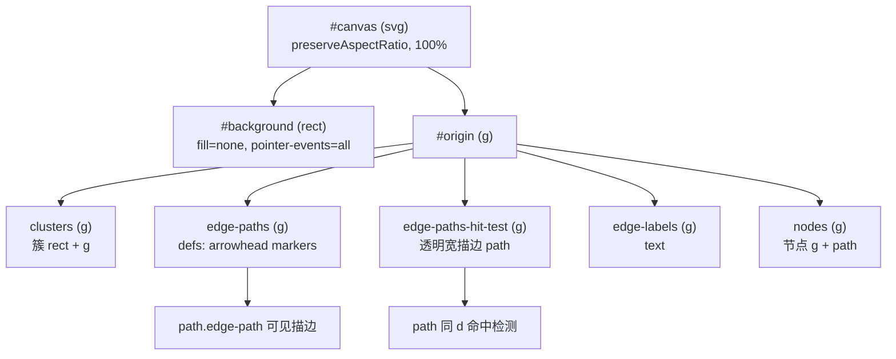

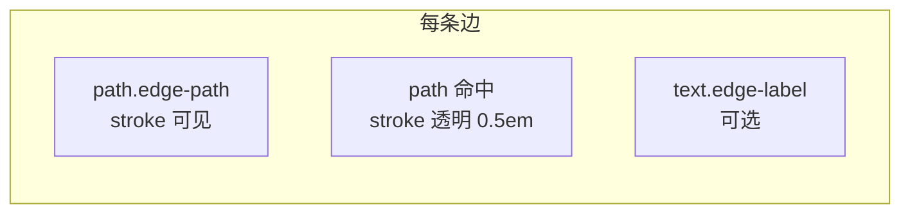

### 3.2 边路径绘制（grapher.js）

- **build**：为每条边创建 `<path class="edge-path">`、用于命中检测的 `<path>`（同 d，较粗透明描边）、以及可选 `<text class="edge-label">`。
- **update**：
  - 用 **intersectRect(node, point)** 根据节点中心与 point 的射线与节点半宽半高矩形求交，得到边的**实际端点**（从节点边界出发/进入）。
  - 使用 **grapher.Edge.Curve** 将 points 转为平滑路径：
    - 首尾用上面求得的交点，中间为 layout 给出的 points（去掉首尾两点）。
  - **Edge.Curve**：顺序调用 `point(x,y)`，内部用状态机把连续三点组成一段**三次贝塞尔**（两控制点为 1/3、2/3 分位），得到 `path.data`（SVG path 的 d 字符串）。
  - 最终设置 `element.setAttribute('d', edgePath)`、`hitTest.setAttribute('d', edgePath)`，边标签用 `transform` 和 opacity 显示。

即：**layout 输出折线点 → 首尾与节点矩形求交 → 贝塞尔曲线插值 → 一条 path 描边 + 一条 path 命中检测**。

#### 3.2.1 边路径绘制流程图

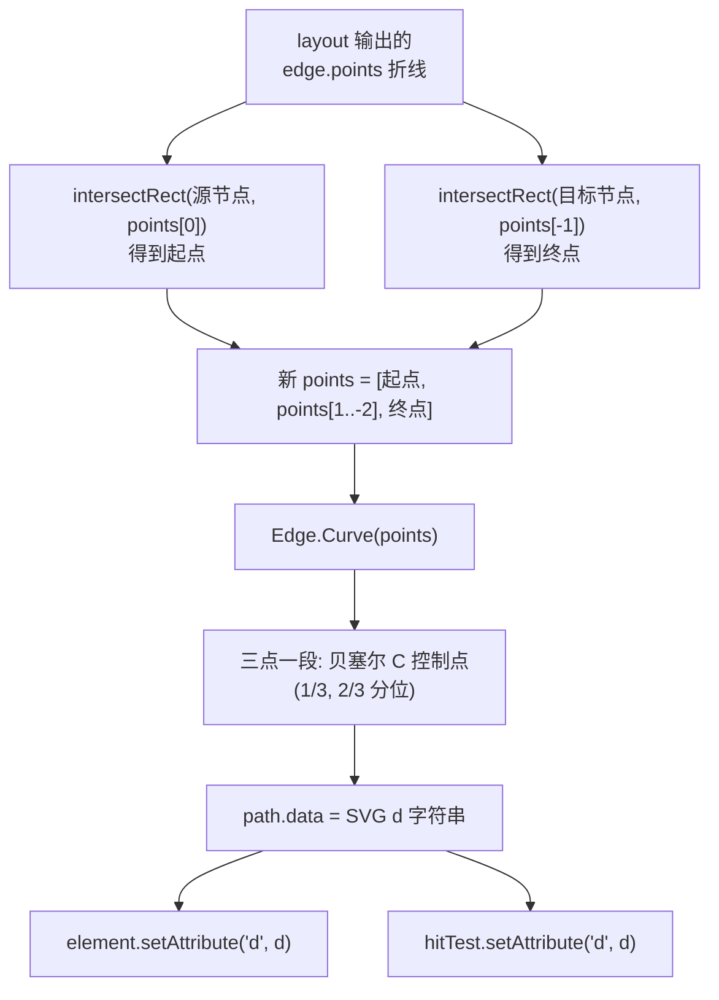

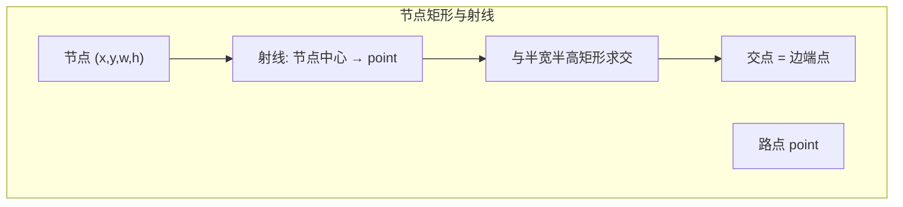

### 3.3 节点与簇

- 叶子节点：`grapher.Node` 由多 block（Header、ArgumentList、Canvas 等）组成，measure 得到 width/height，layout 只做块内垂直排布（y 累加），update 时设置 `transform` 和 `border path`（roundedRect）。
- 簇：用 `rect` + `g`，update 时根据簇的 x,y,width,height 设置 transform 和 rect 属性。

### 3.4 样式（grapher.css）

- 节点：path/line 描边、多种 node-item-type-* 填充色、hover/select 状态。
- 边：默认黑描边、arrowhead marker；select 用红色描边与 arrowhead-select；hit-test 用透明宽描边扩大可点区域。
- 簇：半透明黑填充、细描边。

---

## 四、性能优化设计

### 4.1 大图布局不阻塞主线程

- **条件**：存在 worker 且图较大时，布局在 **Web Worker** 中执行（worker.js 监听 `dagre.layout`，import dagre 后调用并 postMessage 回传）。
- **触发**：`grapher.js` 中 `if (worker)` 时调用 `worker.request({ type: 'dagre.layout', nodes, edges, layout, state }, 2500, '...')`。
- **超时与取消**：`view.Worker` 在 2500ms 后弹出提示并可取消；取消时 `worker.terminate()`，resolve({ type: 'cancel' })。
- **环境**：`view.js` 中 `this._worker = this._host.environment('serial') ? null : new view.Worker(this._host)`，serial 环境下不创建 Worker，布局始终在主线程（便于调试或兼容）。

#### 4.1.1 大图布局 Worker 时序图

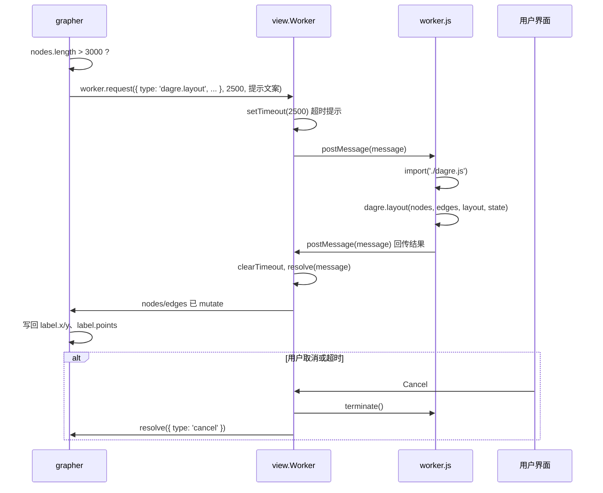

### 4.2 大图 ranker 选择

- `nodes.length > 3000` 时强制 `layout.ranker = 'longest-path'`，避免 network simplex 的迭代开销，缩短单次布局时间，代价是层次可能更宽、边更长。

### 4.3 导出 PNG 时的内存与稳定性

- 导出 PNG 时避免单块超大 canvas：按 **瓦片**（例如 4096×4096 或 targetWidth×4096）用 `getImageData`/`drawImage` 绘制，再写入自定义 `png.Encoder`，总像素限制在约 5e8 以内；若超出则缩小 scale。这样可避免大图导出时 OOM 或浏览器限制。

### 4.4 缩放与视口

- **restore(state)**：根据 getBBox 得到图尺寸，设置 margin、#origin 的 transform、#background 的 width/height、#canvas 的 viewBox/width/height；zoom 来自 state 或默认 1。
- **_updateZoom**：限制 zoom 范围（如 0.15～1.4），以当前鼠标或容器中心为缩放中心，用 scrollLeft/scrollTop 与 style.width/height 实现“缩放+平移”的体验，避免整图重算布局。

#### 4.4.1 缩放与视口示意图

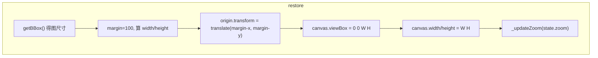

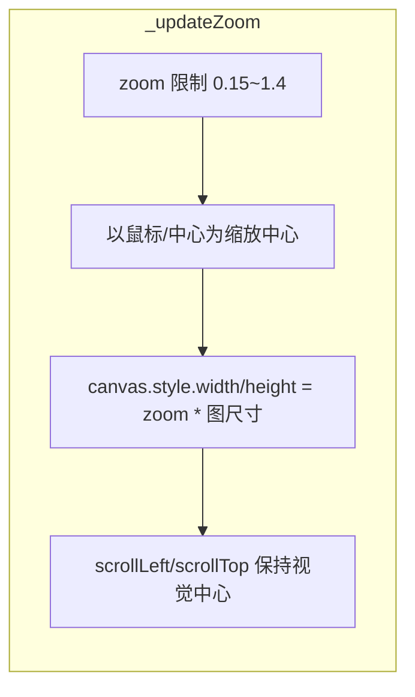

#### 4.3.1 PNG 分块导出流程

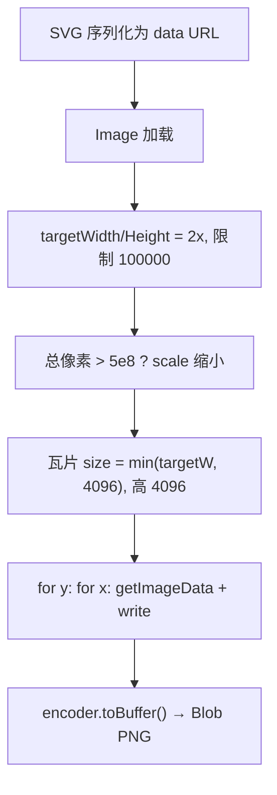

### 4.5 字体与测量时机

- **measure** 前会 `document.fonts.ready` 和多次 requestAnimationFrame，减少测量时字体未加载导致的尺寸抖动。

---

## 五、关键代码位置速查

| 功能 | 文件 | 大致行号/说明 |
| ------ | ------ | ---------------- |
| 渲染入口、Worker 传入 | view.js | 663-691 render()；32 _worker 创建 |
| 布局调用、大图 Worker/ranker | grapher.js | 219-324 layout(worker)；255-260 nodes.length>3000 |
| 节点/边 SVG 构建 | grapher.js | 104-210 build；301-322 update；878-911 Edge update、Curve |
| 边曲线 Path/贝塞尔 | grapher.js | 935-1055 Edge.Curve、Edge.Path |
| dagre 主入口与写回 | dagre.js | 8-2228 layout()；2207-2224 写回 nodes/edges |
| rank（longest-path / network simplex） | dagre.js | 253-415 rank；407-415 ranker 分支 |
| 分层与排序 | dagre.js | buildLayerMatrix；order（885-1510）；position（1594-1995） |
| 边 points 生成 | dagre.js | normalize/denormalize（710-774）；assignNodeIntersects（2105-2155） |
| Worker 消息处理 | worker.js | 12-29 message → dagre.layout |
| view.Worker request/cancel | view.js | 1518-1578 |
| 画布创建、restore、zoom | view.js | 1791-1816 build；1888-1939 restore；1995-2018 _updateZoom |
| PNG 分块导出 | view.js | 764-800 |

---

## 六、可借鉴到 df-scheduler-viz 的点

1. **按节点数切换布局策略**：例如超过 N 节点用“长路径分层 + Worker”，否则用完整 network simplex 或当前 dagre 配置。
2. **Worker 超时与取消**：大图布局带延迟提示和可取消，避免长时间无反馈。
3. **边与节点边界交点**：用射线与矩形求交得到边的首尾点，再配合贝塞尔曲线，可减少边与节点重叠、提升可读性。
4. **导出大图**：需要高分辨率 PNG 时，可参考瓦片绘制 + 总像素上限，避免单 canvas 过大。
5. **布局参数集中**：nodesep/ranksep/rankdir 等在 grapher 一处配置，便于与 cp_viz 布局设计文档中的常量对应与调优。

---

*文档基于 Netron 源码（约 2026-02 版本）整理，若版本差异导致行号或 API 变化，请以实际代码为准。*
